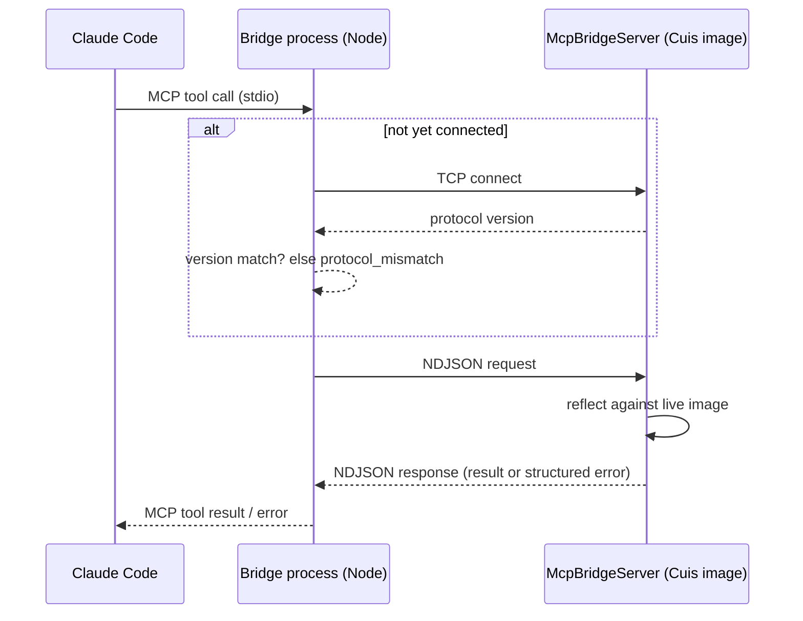

# Cuis MCP Bridge — Technical Spec

## Context

This repo (`/Users/jorge.perez/Cuis`, containing `Cuis7-8-main`, `Cuis7-8-main-UserFiles`,
and `initiatives/`) contains no bridge code today. Both new components live inside this same
repo, under a new top-level `mcp-bridge/` directory — no separate repos, no submodules (per
`initiative.md`'s Scope and Decisions). This plan is grounded in patterns already present in
`Cuis7-8-main`, which the new code should follow rather than reinvent.

**Package file format and how it's loaded.** `Cuis7-8-main/Packages/Features/JSON.pck.st:1-35`
shows the canonical shape: a `!provides:`/`!requires:` header, `SystemOrganization
addCategory:`, `!classDefinition: #Foo category: #Bar!` blocks, and `!Foo methodsFor:
'protocol' stamp: '...'!` method chunks. The `!provides:` header is what makes a fileIn
register as an entry in the **Installed Packages** tool — confirmed against the running
image (World → Open → Installed Packages) and the **File List** tool (World → Open → File
List), which is how the developer will load `mcp-bridge/image/MCP-Bridge.pck.st`: browse to
the file and fileIn it, exactly like any package under `Cuis7-8-main/Packages/`. The new
Cuis-side package follows this exact format under its own category (e.g. `MCP-Bridge`), and
lives at `mcp-bridge/image/MCP-Bridge.pck.st` rather than inside `Cuis7-8-main/Packages/`
(keeping it out of the distribution tree, but still File List/Installed-Packages
compatible since both tools work off the filesystem, not a fixed directory).

**JSON encode/decode already exists in-image.** `Cuis7-8-main/Packages/Features/JSON.pck.st`
defines `Json` (read/write JSON) and `JsonObject`/`JsonSyntaxError`. The Cuis-side component
should depend on this package (`!requires: 'JSON' ...`) rather than hand-roll a parser.

**Socket server pattern already exists.** `Cuis7-8-main/Packages/System/Network-Kernel.pck.st`
defines everything needed for the server side:
- `Socket` (`:127-...`) with `listenOn:backlogSize:` (`:1702-1709`) and `accept`/
  `waitForAcceptFor:ifTimedOut:` (`:1604`, `:2727-2738`).
- `ConnectionQueue` (`:97-688`) is a ready-made accept-loop helper: class-side
  `portNumber:queueLength:` (`:684-688`) spins up a forked `Process` (`:594-607`) running
  `listenLoop` (`:609-639`), which queues incoming connected sockets; `getConnectionOrNil`
  (`:520-533`) pops one (or `nil`), and `destroy` (`:506-518`) tears down the listener and
  all queued sockets. This is a better foundation than a hand-rolled accept loop — it
  already handles the BSD-style-vs-legacy socket fallback (`:625`) and stale-connection
  pruning.

**Reflection APIs already exist.** `Cuis7-8-main/CuisImage/Cuis7.8.sources`:
- `Categorizer` (`:22121-...`), the class backing both `SystemOrganization` (class
  categories) and each class's method organizer: `categories` (`:22170-22172`, returns the
  category/protocol name array) and `listAtCategoryNamed:` (member lookup by category).
  `SystemOrganization categories` / `SystemOrganization listAtCategoryNamed: aSymbol` cover
  `list_categories`/`list_classes`; `aClass organization categories` /
  `aClass organization listAtCategoryNamed: aSymbol` (instance side) and the same sent to
  `aClass class` (class side) cover `list_protocols`/`list_methods`.
- `CompiledMethod>>sourceCode` (referenced at `:91121`, `:147774`) backs
  `get_method_source`, reached via `(aClass compiledMethodAt: selector) sourceCode` (or the
  class-side equivalent via `aClass class`).
- Standard `ClassDescription`/`Behavior` protocol (`superclass`, `instanceVariableNames`,
  `classVariableNames`, `category`, `comment`) backs `get_class_definition` and
  `get_class_comment`. Exact selector names to confirm against the running image during
  implementation (Step 5 below) — this is standard-enough Smalltalk-80 protocol that no
  design decision hinges on it.

**Test convention.** `Cuis7-8-main/Packages/System/Tests-Network.pck.st:11-31` shows the
expected shape: a `Tests-<PackageName>` package, `TestCase subclass: #FooTest`, `setUp`/
`tearDown`. The new Cuis-side package's tests follow this as `Tests-MCP-Bridge`.

**External process: greenfield.** No Node/TypeScript project exists anywhere in this repo
tree — the bridge process is built from scratch at `mcp-bridge/server/` using the official
`@modelcontextprotocol/sdk` (stdio transport toward Claude Code) plus Node's built-in `net`
module (TCP client toward the Cuis-side server), per the decisions already recorded in
`initiative.md`.

## Proposed changes

Two components, both new, living side by side under `mcp-bridge/` in this repo and
communicating over the TCP/NDJSON protocol decided in `initiative.md` (`## Decisions`).

### `mcp-bridge/image/` — Cuis-side package

- **`McpBridgeServer`** (class-side `startOn: aPort`, `stop`) — owns a `ConnectionQueue`
  (see Context) and a polling loop (forked `Process`, `Delay` between polls) that calls
  `getConnectionOrNil`. Never starts automatically (invariant 11); only via an explicit
  class-side call the developer triggers from a doIt or a World/System menu item.
  Binds/listens with no interface argument other than loopback, satisfying invariant 15.
- **Single-session enforcement (invariants 20, 21)** — `McpBridgeServer` tracks at most one
  active `McpBridgeConnection`. When `getConnectionOrNil` yields a socket while a connection
  is already active, it writes a single `session_busy` error message to the new socket and
  closes it immediately, never creating a second `McpBridgeConnection`. The active
  connection's last-activity timestamp is checked on a timer; past the inactivity timeout it
  is torn down and the slot freed, regardless of TCP-level state.
- **`McpBridgeConnection`** (one per accepted socket) — owns the request loop: read a
  newline-delimited chunk, decode with `Json`, dispatch, encode the response with `Json`,
  write it followed by a newline. On connect, first exchanges the protocol-version handshake
  (invariant 14) before accepting any tool request. Malformed JSON or an unrecognized
  operation name never crashes the loop — it responds `invalid_request` and continues
  (invariants 9, 10). Any unexpected `Error` signaled while executing a reflection operation
  is caught at this layer and turned into an `internal_error` response rather than
  propagating (invariant 22).
- **Reflection operations** — one method per tool (`list_categories`, `list_classes:`,
  `list_protocols:`, `list_methods:protocol:side:`, `get_method_source:selector:side:`,
  `get_class_definition:`, `get_class_comment:`), implemented against the APIs identified
  in Context. Each validates its target exists first and answers a `not_found` error
  Dictionary if not (invariant 8), otherwise answers a plain `Dictionary`/`Array` structure
  ready for `Json` encoding. List-returning operations sort their result alphabetically
  before returning (invariant 2).
- **Protocol version** — a class-side constant on `McpBridgeServer` (or a dedicated
  `McpBridgeProtocol` class holding just the version number and error-code symbols), bumped
  whenever the wire schema changes.
- **Port** — a fixed, hardcoded default (e.g. `6789`), documented in `PROTOCOL.md` as the
  single source of truth both sides read from. The developer's manual trigger
  (`McpBridgeServer startOn: 6789`) and the bridge's `cuisClient` default connect target both
  reference this same documented number; no discovery or negotiation mechanism is needed for
  a single-developer, single-machine setup.

### `mcp-bridge/server/` — bridge process, Node.js/TypeScript

- **`src/protocol.ts`** — TypeScript types for every request/response shape and the error
  codes (`not_found`, `invalid_request`, `internal_error`, `protocol_mismatch`,
  `session_busy`, `unreachable`), plus the protocol version constant this bridge build
  expects. This file is the TS mirror of the Cuis-side schema; since Smalltalk and
  TypeScript can't literally share a types file, both sides' `PROTOCOL_VERSION` must be
  bumped together by convention — documented in `PROTOCOL.md`, not enforced by tooling.
- **`src/cuisClient.ts`** — a small TCP client wrapping Node's `net.Socket`: connect,
  NDJSON framing (buffer until `\n`, `JSON.parse`/`JSON.stringify`), the version handshake on
  connect (invariant 14 — mismatch throws a typed `ProtocolMismatchError` before any tool
  call is attempted), and a single in-flight-request queue so concurrent MCP tool calls from
  Claude Code are serialized onto the one TCP session (satisfies invariant 19 from the
  client side — Cuis only ever sees one outstanding request at a time). A connect timeout
  and a per-request timeout both resolve to `unreachable` (invariant 12) instead of hanging.
  On a detected disconnect, the next call re-runs the connect+handshake sequence once before
  failing (invariant 13).
- **`src/tools.ts`** — the 7 MCP tool definitions (name, JSON-schema input, handler), each a
  thin adapter: validate input shape, call `cuisClient`, map a `not_found`/`invalid_request`/
  `internal_error`/`unreachable`/`protocol_mismatch`/`session_busy` response into an MCP
  tool error result with the code and message preserved (so Claude Code can distinguish
  them, per functional-spec's error invariants).
- **`src/index.ts`** — process entrypoint: constructs the `@modelcontextprotocol/sdk` server
  over the stdio transport, registers the tools from `src/tools.ts`, starts listening. Does
  not eagerly connect to Cuis at startup — the first tool call triggers the first connection
  attempt, so the bridge process can start before the image does.
- **`README.md`** — manual setup instructions, including how to point Claude Code at the
  built bridge (adding an entry to its MCP server config, e.g. `.mcp.json`, pointing to the
  compiled `src/index.ts` entrypoint). Registering the server with Claude Code stays a
  documented manual step, not an automated part of this delivery.

### Data flow



## Implementation sequence

1. `mcp-bridge/image/MCP-Bridge.pck.st` scaffold — package manifest in the existing
   `.pck.st` header format (`!provides:`/`!requires:`), new `MCP-Bridge` category,
   `!requires: 'JSON' ...`; verify it fileIns via File List and appears in Installed
   Packages before writing any behavior into it.
2. `PROTOCOL.md` at `mcp-bridge/` (kept in sync by convention across the two components) —
   the NDJSON request/response schema, protocol version number, and the six error codes.
3. `McpBridgeServer` — manual start/stop, `ConnectionQueue`-backed accept loop, localhost
   bind, single-session enforcement, inactivity timeout (invariants 11, 15, 20, 21).
4. `McpBridgeConnection` — NDJSON read/write loop via `Json`, version handshake, dispatch,
   structured error responses for bad input and internal failures (invariants 9, 10, 14, 22).
5. Reflection operations — the 7 tool methods, each backed by the APIs identified in
   Context, alphabetically sorted list results, `not_found` for missing targets (invariants
   2, 4-8, 16-18).
6. `Tests-MCP-Bridge` package — SUnit tests per the Testing section below.
7. `mcp-bridge/image/run-tests.st` — headless test-runner script (fileIn both packages,
   run the suite, exit non-zero on failure), verified with the `-s ...` VM invocation
   from the Testing section.
8. `mcp-bridge/server/` scaffold — `package.json`, `tsconfig.json`,
   `@modelcontextprotocol/sdk` dependency.
9. `src/protocol.ts` — TS types and error codes mirroring step 2's schema.
10. `src/cuisClient.ts` — TCP client: connect/handshake/reconnect/timeout/request-queue
    (invariants 12, 13, 14, 19).
11. `src/tools.ts` — the 7 MCP tool adapters, error-code translation.
12. `src/index.ts` — MCP server entrypoint wiring stdio transport to the tools.
13. `README.md` — manual setup steps, including registering the built bridge in Claude
    Code's MCP server config.
14. End-to-end manual verification: real Cuis image with `McpBridgeServer startOn: 6789`
    run, bridge process pointed at it, every tool and every error path exercised through an
    MCP client (or Claude Code itself, using the README's registration step).

## Testing and validation

**Running the Cuis-side tests headlessly.** The Cuis VM has a built-in batch mode
(`SystemDictionary>>displayCommandLineUsageOn:`, `Cuis7.8.sources:~172661`) that avoids the
GUI SUnit Test Runner entirely — needed for these tests to run outside a manual World-menu
click:

- **`-headless`** (VM-level flag, must appear *before* the image path) runs with no window
  at all. Confirmed against Cuis's own CI (`Cuis-Smalltalk-Dev/.ContinuousIntegrationScripts/installVm.sh`,
  which sets `CUIS_VM_ARGUMENTS="-headless"` on macOS) and verified empirically: without it,
  the VM opens a real window and, if anything ever prompts for input, blocks waiting for it
  — fatal for an unattended/CI run. `-s`/`-r`/`-e`/etc. are Cuis-level flags parsed by
  `SystemDictionary` and go *after* the image path (`-help` on the VM binary confirms the
  option-vs-argument split at the image path). `-s <script.st>` compiles and evaluates a
  `.st` file; `-e` (development only) opens a Debugger on an unhandled exception instead of
  swallowing it. `RunCuisOnMac.sh` / `RunCuisOnLinux.sh` forward extra arguments to the VM
  unchanged, so `-headless` can be passed through them too.
- **Avoid the interactive author-initials prompt**: compiling a method whose source has no
  explicit stamp (e.g. `SomeClass compile: 'foo ^1'`, as opposed to fileIn-ing a chunk that
  already carries a `stamp: '...'`) makes Cuis pop a modal "Please type your initials"
  dialog if no author is set — which hangs forever under `-headless` with nothing attached
  to answer it (confirmed empirically). Any script that compiles code ad hoc (not just
  fileIn-ing already-stamped package chunks) must call
  `Utilities setAuthorName: '<name>' initials: '<initials>'` first. The real
  `mcp-bridge/image/*.pck.st` package chunks already embed a stamp and don't need this, but
  `run-tests.st` itself should still set it defensively before anything that might compile.
- SUnit itself is fully programmatic: `TestCase class>>buildSuiteFromSelectors` builds a
  `TestSuite`, `run` returns an inspectable `TestResult` (`hasFailures`, `hasErrors`).
- **Exit code**: confirmed against Cuis's own CI
  (`Cuis-Smalltalk-Dev/.ContinuousIntegrationScripts/runTests.st`, the upstream project's
  real headless test runner) — the correct way to quit the VM with a specific exit code
  from a script is `Smalltalk quitPrimitive: exitCode`, not `SystemDictionary exitWith:`.
  The script controls the exit code itself, so it is invoked *without* `-q` (`-q` would
  quit the VM after the script regardless of outcome, before `quitPrimitive:` gets a
  chance to set a meaningful code).
- **stdout output**: use `StdIOWriteStream stdout nextPutAll: ...; newLine; flush` rather
  than `Transcript showCr:` to print from a headless script — this is what Cuis's own
  `TestResultConsolePrinter` (in the same CI reference) does, and what verified reliably
  empirically; `Transcript` is normally backed by a Morphic window that doesn't exist
  headless, so relying on it for CI-visible output is unconfirmed and unnecessary risk.

A `mcp-bridge/image/run-tests.st` script fileIns the package and its test package, runs the
suite, prints the result, and exits non-zero on failure:

```smalltalk
| result exitCode |
Utilities setAuthorName: 'Jorge Luis Perez' initials: 'jlp'.
(FileStream readOnlyFileNamed: 'mcp-bridge/image/MCP-Bridge.pck.st') fileIn.
(FileStream readOnlyFileNamed: 'mcp-bridge/image/Tests-MCP-Bridge.pck.st') fileIn.

result := McpBridgeTests buildSuiteFromSelectors run.
StdIOWriteStream stdout nextPutAll: result printString; newLine; flush.
exitCode := (result hasFailures or: [ result hasErrors ]) ifTrue: [ 1 ] ifFalse: [ 0 ].
Smalltalk quitPrimitive: exitCode
```

invoked as:

```bash
./Cuis7-8-main/CuisVM.app/Contents/MacOS/Squeak \
  -headless \
  Cuis7-8-main/CuisImage/Cuis7.8.image \
  -s mcp-bridge/image/run-tests.st \
  < /dev/null
```

(`< /dev/null` closes stdin defensively — the empirical verification ran this way; it costs
nothing and rules out any stdin-read-related blocking.)

This is what "SUnit tests" below means in practice — no manual GUI interaction required to
verify the Cuis-side invariants.

**Cuis-side (`Tests-MCP-Bridge`, SUnit):**
- Invariants 4-7 — one test per tool against a fixture category/class/protocol built in
  `setUp` (a throwaway class defined and removed by the test), covering the empty-result
  and side-independence cases directly against the reflection methods (no socket needed).
- Invariant 2 — assert list-returning reflection methods return alphabetically sorted
  results given a fixture with out-of-order names.
- Invariant 8 — assert each reflection method answers a `not_found` error Dictionary for a
  nonexistent category/class/protocol/selector, rather than signaling an unhandled `Error`.
- Invariant 22 — inject a reflection failure (e.g. stub a method to signal an arbitrary
  `Error`) and assert `McpBridgeConnection` converts it to `internal_error` without
  propagating.
- Invariants 20, 21 — open two raw `Socket` connections to a test `McpBridgeServer`
  instance; assert the second gets `session_busy` and is closed; assert an idle connection
  is freed after the (test-shortened) inactivity timeout elapses.
- Invariant 15 — assert the listening socket is not reachable via a non-loopback interface
  (or assert the bind call used only the loopback address, whichever is testable without
  real cross-host access).

**Bridge process (Node, e.g. Vitest/Jest):**
- Invariant 14 — mock a Cuis-side handshake reporting a mismatched version; assert
  `cuisClient` throws/returns `protocol_mismatch` before any request is sent.
- Invariant 12 — point `cuisClient` at a closed port; assert every tool call resolves to
  `unreachable` within a bounded time (no indefinite hang).
- Invariant 13 — simulate a mid-session socket close; assert the next call reconnects once,
  and that a second consecutive failure surfaces `unreachable`.
- Invariant 19 — fire two tool calls concurrently against a fake Cuis-side echo server that
  fails the test if it receives a second request before responding to the first; assert the
  client serializes them.
- Invariants 8, 9 — fake Cuis-side responses with each error code; assert `src/tools.ts`
  surfaces the code and message in the MCP tool error result unchanged.

**End-to-end (manual, step 14 above):**
- Invariants 1, 3, 16 — with a real image, call each tool, then modify the image (recompile
  a method, add a class) and call again; assert the second call reflects the change.
- Invariant 11 — confirm no port is open before `McpBridgeServer startOn:` is evaluated.
- Invariants 17, 18 — confirm by construction: no tool in `src/tools.ts` or
  `McpBridgeConnection`'s dispatch table performs a define/compile/remove or evaluates
  arbitrary source; this is a code-review checklist item, not a runtime test.

## Risks and mitigations

- **NDJSON framing vs. method source containing newlines** — `Json`'s string encoding must
  escape `\n`/control characters inside JSON string values (standard JSON behavior). Verify
  early with a unit test round-tripping a multi-line method source through `Json` before
  building anything on top of it (fold into step 4/5).
- **Image and bridge process drifting apart** — even living in one repo, a running Cuis
  image (loaded once via fileIn) can outlive later edits to `mcp-bridge/image/`, so the
  loaded package and a freshly-built bridge process can still fall out of sync. Mitigated by
  the protocol-version handshake (invariant 14): a stale image surfaces `protocol_mismatch`
  on the next connection rather than silent corruption.
- **`ConnectionQueue`'s legacy fallback path** (`Network-Kernel.pck.st:642-667`, used when
  BSD-style accept isn't available) is less exercised in modern Cuis usage — confirm which
  path the target platform takes during step 3 rather than assuming.

## Follow-ups

- Package-level reflection (which `.pck.st` a class ships in) is out of scope here — tracked
  in `TODO.md` at the project root.
- The write-capable follow-on (defining classes, compiling methods) reuses this same
  `McpBridgeConnection`/protocol-version machinery, per `initiative.md`'s Scope — not
  designed here.
